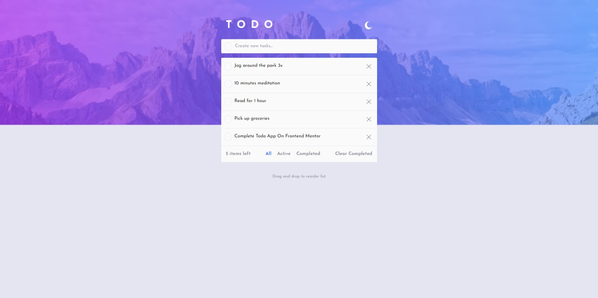

# Frontend Mentor - Todo app solution

This is a solution to the [Todo app challenge on Frontend Mentor](https://www.frontendmentor.io/challenges/todo-app-Su1_KokOW). Frontend Mentor challenges help you improve your coding skills by building realistic projects.

## Table of contents

- [Overview](#overview)
  - [The challenge](#the-challenge)
  - [Screenshot](#screenshot)
  - [Links](#links)
- [My process](#my-process)
  - [Built with](#built-with)
  - [What I learned](#what-i-learned)
  - [Useful resources](#useful-resources)

**Note: Delete this note and update the table of contents based on what sections you keep.**

## Overview

### The challenge

Users should be able to:

- View the optimal layout for the app depending on their device's screen size
- See hover states for all interactive elements on the page
- Add new todos to the list
- Mark todos as complete
- Delete todos from the list
- Filter by all/active/complete todos
- Clear all completed todos
- Toggle light and dark mode
- **Bonus**: Drag and drop to reorder items on the list

### Screenshot

**Note: Delete this note and the paragraphs above when you add your screenshot. If you prefer not to add a screenshot, feel free to remove this entire section.**

### Links

- Solution URL: [Add solution URL here](https://your-solution-url.com)
- Live Site URL: [Add live site URL here]([https://todoapp-react-ts-tailwind.netlify.app/])

## My process

### Built with

- Semantic HTML5 markup
- [TailwindCSS] (https://tailwindcss.com/) - CSS framework
- [React](https://reactjs.org/) - JS library
- [TypeScritp](https://www.typescriptlang.org/) - is JavaScript with added syntax for types
- [DND Kit](https://dndkit.com/) - For Drag and Drop

**Note: These are just examples. Delete this note and replace the list above with your own choices**

### What I learned

I learned to use the CSS styles provided by Tailwind, to type functions, create interfaces, types. Using useState, useEffect, Context. On the other hand to create my own hooks and pass typed Props. Also drag and drop with the dnd-kit library.

**Note: Delete this note and the content within this section and replace with your own learnings.**

### Useful resources

- [React+TS/Midudev](https://youtu.be/4lAYfsq-2TE?si=N3wrTfnxU61U4jEw)
- [CURSO de ReactJS 2024](https://www.youtube.com/watch?v=8GFmoynezyA&t=1342s)
- [React/Fazt] (https://youtu.be/sjrK6RA65eQ?si=dJaguKo4XloIQ5vl)
- [DndKit](https://youtu.be/swFjfjLXe3I?si=1Vc_CvzTL6vv6FU2)

**Note: Delete this note and replace the list above with resources that helped you during the challenge. These could come in handy for anyone viewing your solution or for yourself when you look back on this project in the future.**
